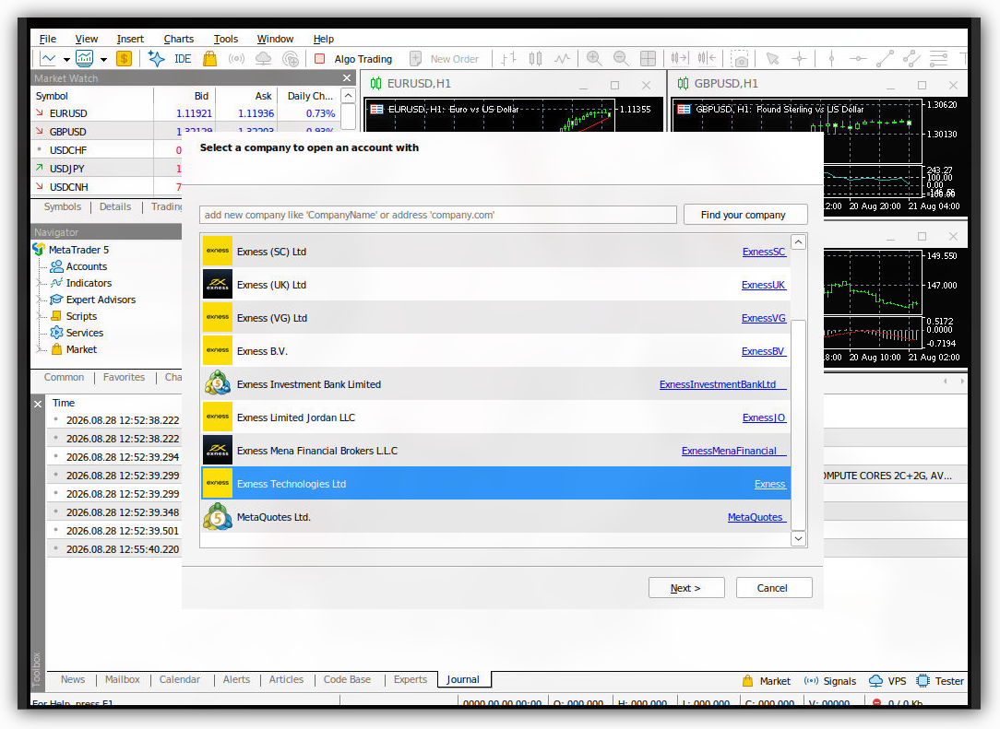
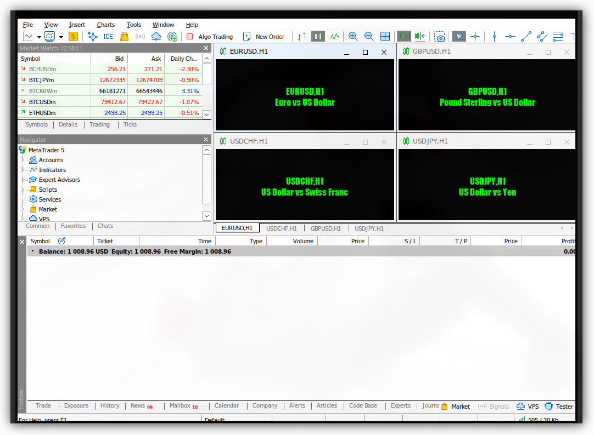
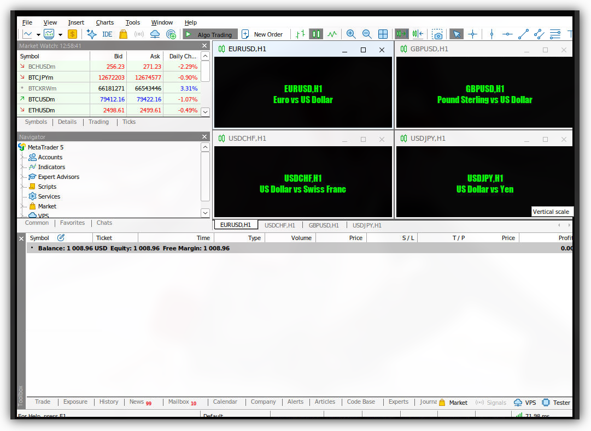

# Quantitative Trading

Unofficial MetaTrader5 adapter for NautilusTrader.

# What this is?

nautilus_mt5 is a adapter for NautilusTrader that containt data and execution client for live trading and fetch data for backtest session.

## Prerequisites

- Docker

# Quick Start

## Installation

```bash
git clone https://codeberg.org/hitagi/nautilus_mt5
cd nautilus_mt5
pip install -e .
```

## Initialization

1. Create a `.env` file in your project root. You can see [example](examples/.env.example)
2. Run the MetaTrader5 platform with docker, simply with `docker compose up mt5-wine -d` from this repo
3. Open `localhost:60832/vnc.html` from your browser to access MetaTrader5 platform throught noVNC
4. Find your server name in MetaTrader5 platform:
   
5. Enable AutoTrading

   Disabled:

   

   Enabled:

   

6. Test the terminal connection with `test/terminal_connection.py` from your project root
7. Now the MetaTrader5 platform is ready to use for live or backtest session

## Backtest

You can see [example](examples/backtest/README.md) for more information

## Live

You can see [example](examples/live/README.md) for more information
